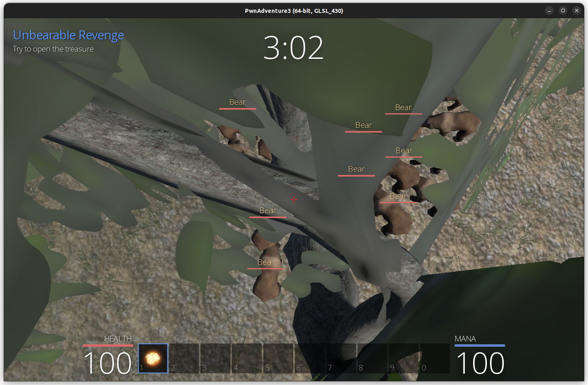
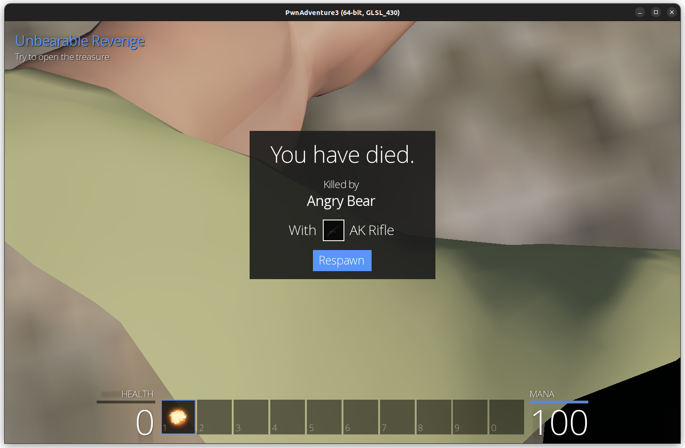
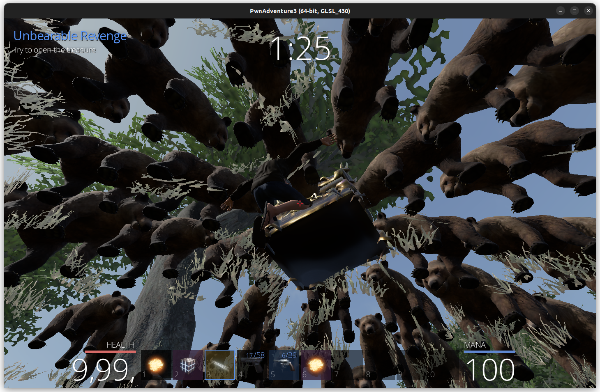
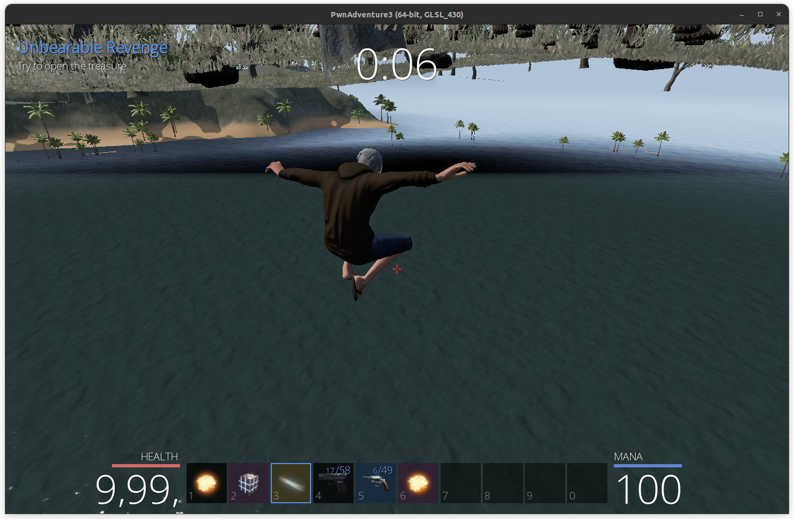

# Walkthrough for Unbearable Revenge

Before Section3, I tried to fly high above the ground to stay away from the bears, which led me to cross the circle and interrupt the mission. When I set my health to maximum, the bears' hits were still powerful enough to kill the player.

When I was jumping around, I ended up landing on the tree, where I thought I would be safe. But the bears have rights and the right they possess is the most dangerous for us, that is Right to Arm Bears. Who even thinks of these rights!! They shot me with AK Rifles when about 1:30s were remaining in the timer

After the Section3, when I played around with tp command, I found that bears couldn't shoot below the ground, so what I tried is teleport to the chest start the timer, then go underground with a command `under` and wait there until the time runs out. The `under` command sets a flag and sets the player position to `current_position - (0, 0, 150)`. This, I was setting at every Tick of the world, but doing just this made the player vibrate a lot. That is, the player is falling due to gravity at every Tick and the position is being reset, this occasionally made the player go out of the circle. So, this time I set the velocity of the player to `(0, 0, 0)` and waited for 5 min.

Then logged out and logged in again, went to the chest and got my flag.