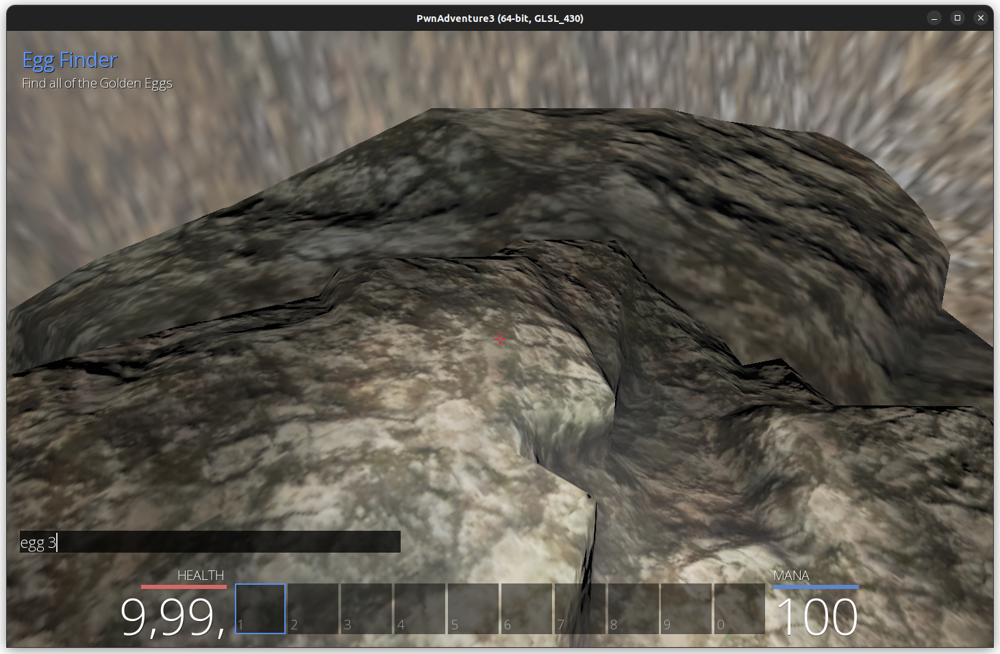
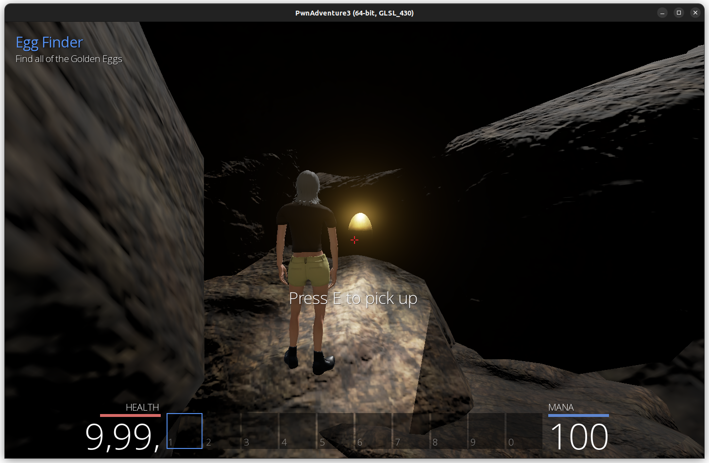
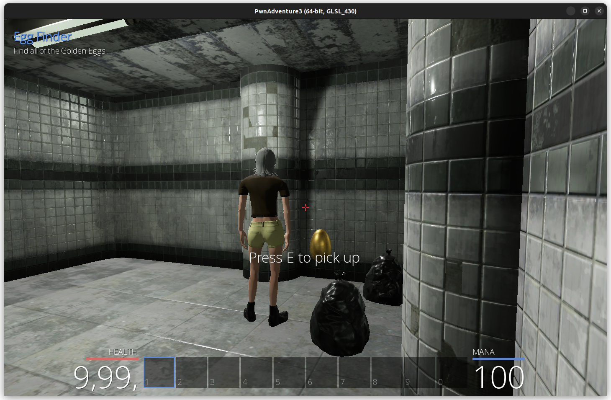
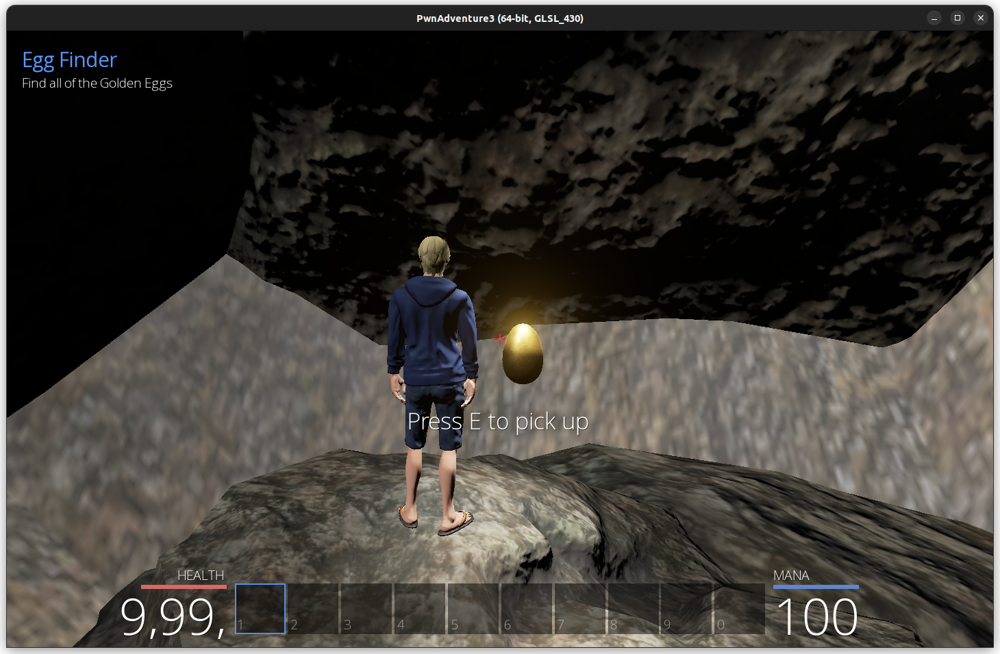
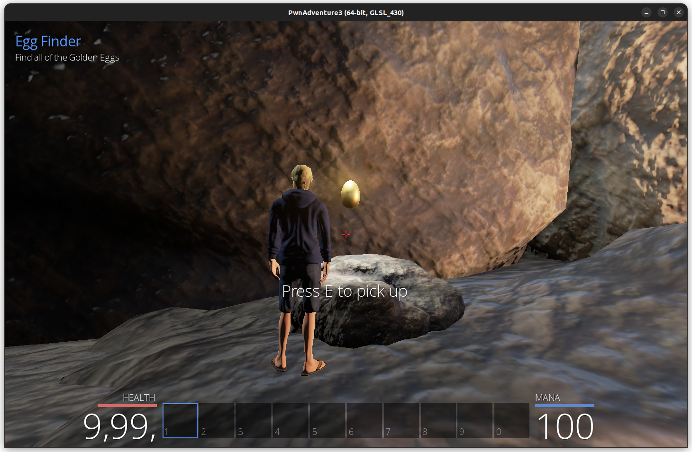
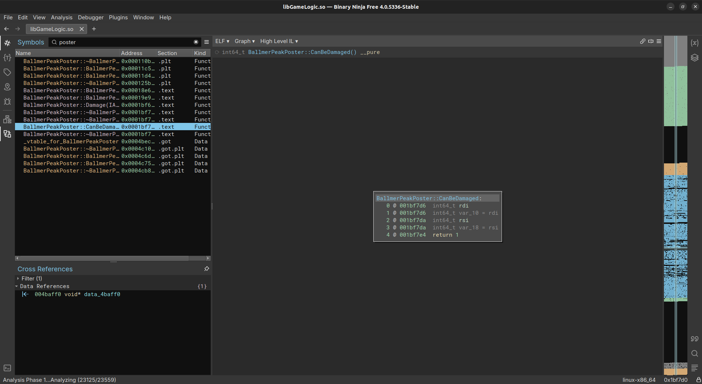
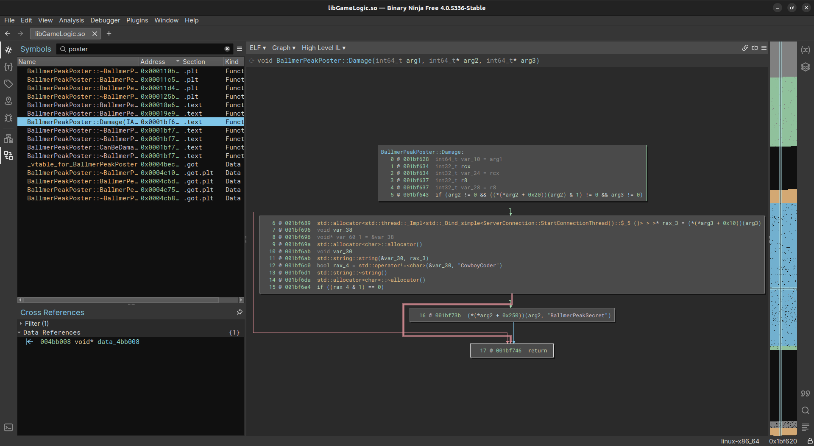

# Collecting the Golden Eggs

From the hint in the problem statement, I assumed the eggs are the objects in the set `((*ClientWorld)GameWorld).m_actors`. This is a set of IActors. I recast their `m_object` to Actor and got the actors in the World

When I checked, all of them don't have a display name, but they have a `m_blueprintName`. The blue print name gave away the eggs.

I used a vector to store all the locations of only the eggs and wrote a script to teleport me to the location of an egg by just typing in `egg <egg-number>` in the chat box.

The egg command

I could only find nine eggs in this way. But there is one more actor, named BallmerPeakEgg, but there is no egg in that position.

There's another actor named BallmerPeakPoster which is an xkcd comic. When I checked the decompiled code, it showed that the `CanBeDamaged()` always returns one.

And when I checked the `Damage()` function, it has an if case that checks if the attack is from a `CowBoyCoder`.

I went on to buy a `CowBoyCoder` and shot the Poster. This made the Egg appear and I got the tenth and the final egg.